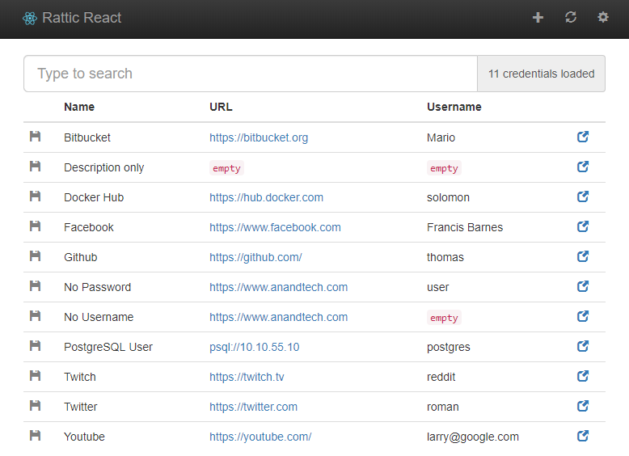

# Rattic React Frontend

A simple react-based frontend for the RatticDB password manager incl. search and credential caching.



## Technologies

 * React
 * Webpack
 * Bootstrap
 * clipboard.js

## Development

The ``src/Globals.js`` file defines the URL that the application tries to connect to. During development, this is likely going to be blocked by the Same-Origin-Policy, so you might want to start Chrome without web-security (on Mac OS X this the command is ``open -a Google\ Chrome --args --disable-web-security``).

To compile everything and run it locally you can use:

```
npm install

# connect to an actual rattic API
npm run prod

# use a fixture
npm run dev
```

## Building

To build the app alone (results are in the ``dist`` folder):
```
npm install -g webpack@3.10.0
webpack -p --define MOCK_API=false
```
